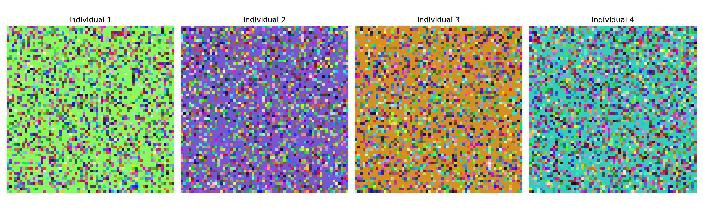
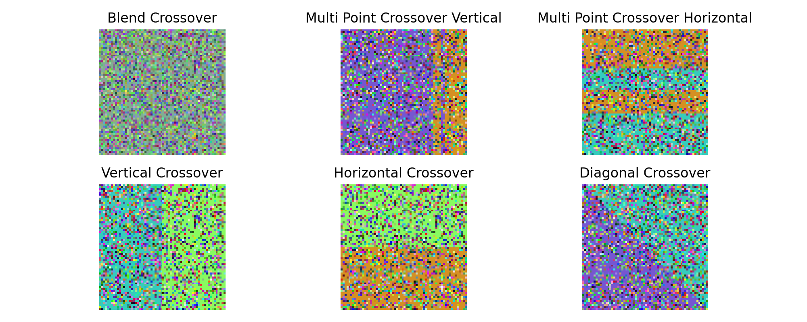
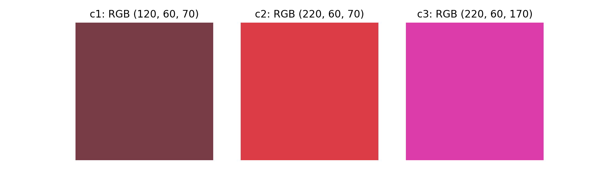

# Optimization For Artificial Intelligence - UniTS  
## Exam Project - Fall 2024 - Emanuele Ruoppolo  

### Image Generation Using Genetic Algorithms  

#### **1. Problem Definition**  
The goal of this project is to evolve a low-resolution, pixel-art style image (e.g., 32x32, 64x64, or 128x128 grid) that approximates a target image. The **target image** is a high-resolution image (e.g., a photograph or artwork), and the **output** is a pixel-art image that captures the essence of the target image but is constrained by the low resolution.

#### **2. Preprocessing**  
To approximate a high-resolution image with a lower-resolution one, we will define an appropriate fitness function. To use the fitness function effectively, the target image must first be resized into a lower-resolution version, which serves as a guide for the generation process. The image pixel values are normalized to 8-bit integers (0–255) to ensure a consistent and proper format for generation.

These operations are performed using the `Image` module from the `Pillow` package.

```python
from PIL import Image

def load_image(image_path: str, target_resolution: tuple) -> np.ndarray:
    img = Image.open(image_path).convert("RGB")
    img = img.resize(target_resolution, Image.Resampling.LANCZOS)
    return np.array(img)
```

---

### **3. Initial Population Generation**  
To generate an initial **random population** of individuals (images), we opted for a pixel-based strategy. Each individual is composed of randomly chosen pixel colors on a colored background. This choice was preferred over a completely noisy image since images often have a dominant color. This strategy could help in identifying it a priori without waiting for it to emerge from noise.  

Regarding the **image format**, we decided to work with square images for simplicity. Each individual is a 3D array of size $n \times n$, where each cell holds a color divided into three RGB channels.
<div style="text-align: center;">
    
</div>
---

### **4. Crossover and Mutation**  
To enhance diversity, we implemented six different recombination methods for the population and one mutation strategy:

- **Crossover Mechanism:** Two parent individuals are combined to create offspring. The crossover can occur at a random point in the chromosome, swapping parts of the image between the two parents.  
  - **Single-Point Crossover:** The parents' genomes are split in half, and the left and right parts are exchanged:  
    - **Horizontal:** The images are split into two horizontal bands and combined.  
    - **Vertical:** The images are split into two vertical bands and combined.  
    - **Diagonal:** The images are split into two parts along a random diagonal and combined.  
  - **Multi-Point Crossover:** The parents' genomes are split into multiple sections and randomly combined:  
    - **Horizontal:** The images are split into horizontal bands, randomly selected, and combined.  
    - **Vertical:** The images are split into vertical bands, randomly selected, and combined.  
  - **Blending Crossover:** The parents' genomes are combined using a weighted sum based on a random coefficient $\alpha \in [0, 1]$. The images are then blended using a random opacity parameter $\alpha$:  

$$G = \alpha G_A + (1 - \alpha) G_B$$

<div style="text-align: center;">
    
</div>

- **Mutation:** After each crossover, to maintain diversity and avoid premature convergence, offspring genomes undergo random mutations. A mutation consists of a random change in a pixel's color. The number of mutations is controlled by a **mutation rate** hyperparameter, which exponentially decreases over time:  

$$\text{mutation rate}(t) = \text{mutation rate}(0) \cdot \exp(-\beta \cdot t)$$

---

### **5. Fitness Function Design and Selection**  
The fitness function evaluates how close each evolved image is to the target image, considering both visual accuracy and the constraints of the pixel-art style. Pixels represented using the RGB standard are treated as vectors of three integers $$(r, g, b) \in [0, 255]^3$$. This representation allows us to use vector-based metrics, such as MSE (Mean Squared Error):  

$$\text{MSE} = \frac{1}{N} \sum_{i=1}^n (y_i - \tilde{y}_i)^2$$

MSE is bounded in the range $$[0, 65025]$$. However, color differences in terms of visual perception may not align with these geometric differences. For example:  

- $c_1$ vs $c_2$: Normalized MSE = 0.05  
- $c_2$ vs $c_3$: Normalized MSE = 0.05  
- $c_1$ vs $c_3$: Normalized MSE = 0.10  

<div style="text-align: center;">
    
</div>

Since MSE may lead to suboptimal solutions, we also considered the [Delta_E metric](http://zschuessler.github.io/DeltaE/learn/), which evaluates color differences in the CIE-LAB color space. Here, $L$ represents perceptual lightness, while $a$ and $b$ represent red-green and blue-yellow color axes. The metric computes the Euclidean distance in this space:  

$$\Delta E_{ab} = \sqrt{(L_2 - L_1)^2 + (a_2 - a_1)^2 + (b_2 - b_1)^2}$$

This metric is bounded in $[0, 100]$, where values in $[0, 10]$ indicate barely perceptible differences, and the maximum indicates opposite colors. Delta_E values capture color differences more effectively:  

- $c_1$ vs $c_2$: Normalized $\Delta E_{ab} = 0.47$  
- $c_2$ vs $c_3$: Normalized $\Delta E_{ab} = 0.57$  
- $c_1$ vs $c_3$: Normalized $\Delta E_{ab} = 0.56$  

We studied evolution using both MSE and mean $\Delta E$ to evaluate **pixel matching** and measure differences between the evolved image and the target image at each pixel location.

The **selection mechanism** involved selecting individuals for reproduction based on their fitness scores. Higher fitness increases the likelihood of being selected. We used a **tournament selection** strategy, randomly selecting a subset of individuals and choosing the best in terms of fitness among them.

--- 

### **6. New Generation, Evolution and Termination**
After reproduction and mutation, the offspring replaces a portion of the population. A hyperparameter, **replacement rate**, determines the number of individuals in the initial population to be replaced. These individuals are selected based on their fitness, ensuring that those with the worst fitness scores are replaced by the same number of offspring from the new population with the best fitness scores. By repeating this process over multiple generations, the population of images evolves and improves through this **steady state** strategy.

To prevent stagnation in local minima, we implemented additional strategies. The algorithm is set to stop after a fixed number of generations, but an **anti-stagnation strategy** is employed if no improvement in the fitness function is observed for a certain period. This strategy temporarily increases the mutation rate, introducing noise to help the algorithm escape from local minima. The mutation rate then decreases again according to the exponential decay rule. This operation is applied a limited number of times. If the fitness function still fails to improve significantly after a set number of generations, the algorithm is **early stopped**. 

This early stopping criterion serves two purposes: it either indicates that the evolved image closely approximates the target image or confirms that the evolution process has failed to produce a satisfactory result. Fortunately, our tests consistently support the first hypothesis.

---
### **7. Output and Results**
After the final generation, the algorithm outputs the **evolved best individual**, which is saved and displayed. Additionally, intermediate results are saved to allow visualization of the evolution process over the generations.

The results of the tests show that, despite the expectation that MSE might not yield the best visual results, it consistently outperforms the $\Delta E_{ab}$ function. We tested the algorithm on images of different sizes, and across the same number of generations, MSE demonstrated better performance in terms of both efficiency and fitness results. 

The lower efficiency of $\Delta E_{ab}$ is likely due to the conversion from RGB space to CIE-LAB space, which requires the `rgb2lab` function from the `skimage.color` library. While it is possible that $\Delta E_{ab}$ might converge to an optimal solution given a higher number of iterations, its computational cost—approximately three times slower than the MSE-based approach—made further tests impractical within our constraints. A more efficient implementation or an optimized strategy for using this metric could be explored in future work to enable a more thorough comparison.

Nonetheless, the results achieved with MSE are satisfactory. With a sufficient number of iterations, no significant issues with color tonalities are observed, and the evolved images align well with the target images. Below we show an example of generation for the $128\times128$ case.

<div style="text-align: center;">
    
</div>


