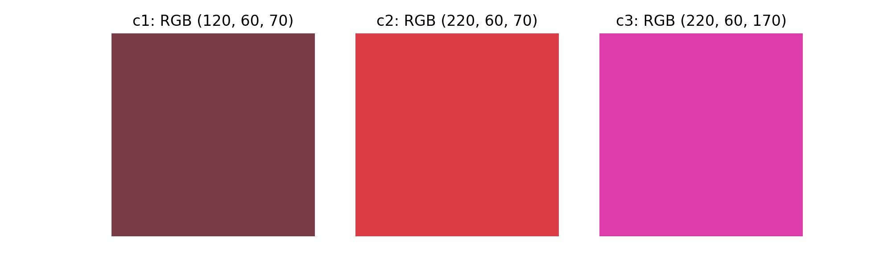
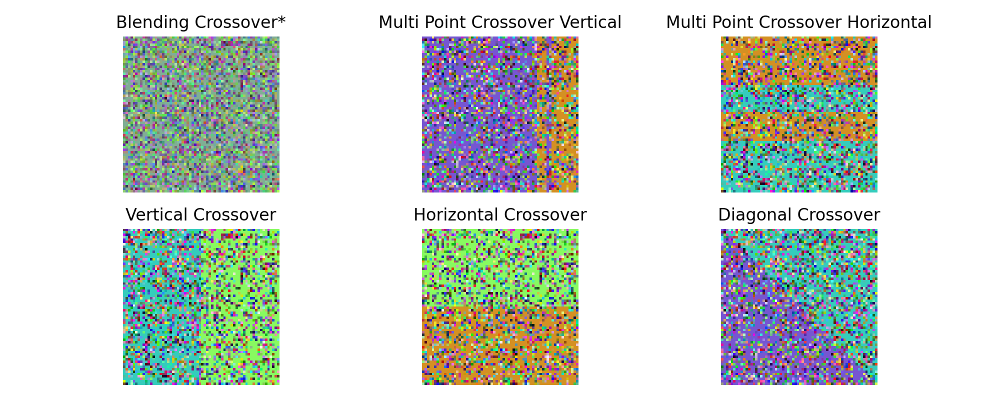
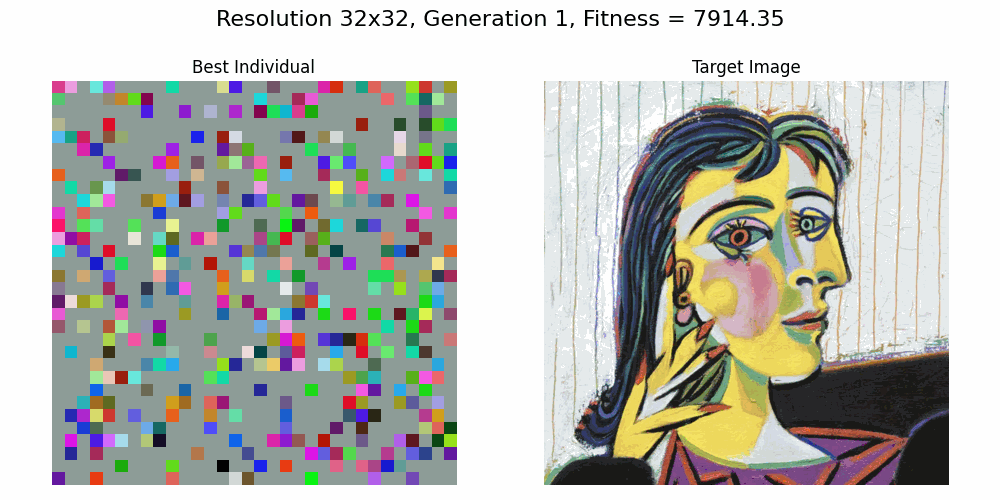
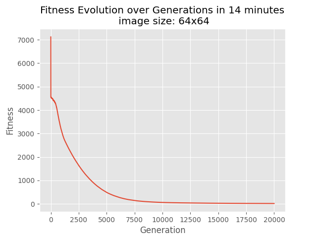
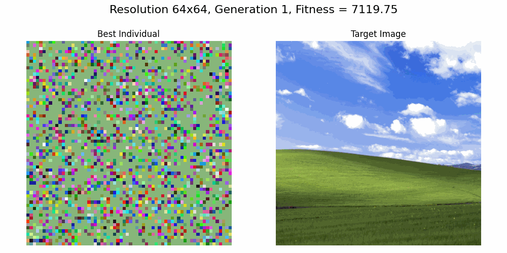

<style>
  :root {
    --color-background: #fff;
    --color-background-code: #E0E0E0;
    --color-background-paginate: rgba(128, 128, 128, 0.05);
    --color-foreground: #345;
    --color-highlight: #99c;
    --color-highlight-hover: #aaf;
    --color-highlight-heading: #99c;
    --color-header: #bbb;
    --color-header-shadow: transparent;
  }

  {
  font-size: 25px
  }

/* Cambia lo sfondo del blocco di codice */
  pre, code {
    background-color: #1E1E1E; /* Sfondo del codice */
    color: #fff;           /* Colore del testo */
    font-family: 'Fira Code', monospace;
    font-size: 25px;
    padding: 13px;
    border-radius: 12px;
  }

  /* Personalizza il colore delle parole chiave, stringhe, ecc. */
  code .keyword {
    color: #569CD6; /* Parole chiave (es: def, return) */
  }

  code .string {
    color: #D69D85; /* Stringhe */
  }

  code .function {
    color: #4EC9B0; /* Nomi di funzioni */
  }

  code .comment {
    color: #6A9955; /* Commenti */
    font-style: italic;
  }

  /* Per il testo normale */
  :root {
    --color-background: #fff; /* Sfondo generale */
    --color-foreground: #345; /* Testo normale */
  }
</style>


# Optimization for Artificial Intelligence
## Image Generation with GA
#### Emanuele Ruoppolo - SM3800049
_Università degli Studi di Trieste - a.y. 2024-2025_ 
**19 December 2024**

---

## Problem statement

- Evolve a low resolution image to approximate a target image of higher resolution.
- **Input:** An image $I$ which resolution is $R=(h\times w)$
- **Output:** An image $I'$ which resolution is $R'=(h'\times w')$ with $h'\ll h ,\, w'\ll w$


---


# Individuals: RGB images

$(h\times w \times3)$ tensor of 8-bit-integers


---

# Preprocessing

- Resizing and normalizing target image


```python
from PIL import Image

def load_image(image_path: str, target_resolution: tuple) -> np.ndarray:
    img = Image.open(image_path).convert("RGB")
    img = img.resize(target_resolution, Image.Resampling.LANCZOS)
    return np.array(img)
```


---
## Fitness function: MSE vs $\Delta E_{ab}$
---
## MSE fitness

$$\text{MSE} = \frac{1}{N} \sum_{i=1}^n (y_i - \hat{y}_i)^2$$

- Easy to compute
- Compatible with RGB space $[0,255]^3$
- May not be aligned with visual perception differences
- Bounded in $[0,65025]$

---
##  $\Delta E_{ab}$ fitness
- CIE-Lab colorspace is a 3D color space defined by the International Commission on Illumination (abbreviated CIE) in 1976. 

- The three axes are: 
  - $L$ - perceptual lightness ax,  $a$ - red/green color ax, $b$ - blue/yellow color ax
$$\Delta E_{ab} = \sqrt{(L_2 - L_1)^2 + (a_2 - a_1)^2 + (b_2 - b_1)^2}$$

- Demanding computation requiring conversion from RGB-space to CIE-Lab space
- Aligned with visual perception differences
- Bounded in $[0,100]$


---

## Differences in fitness



|                | Normalized $MSE$ | Normalized $\Delta E_{ab}$ |
|----------------|:----------------:|:--------------------------:|
| $c_1$ vs $c_2$ | 0.05             | 0.47                       |
| $c_2$ vs $c_3$ | 0.05             | 0.57                       |
| $c_1$ vs $c_3$ | 0.10             | 0.56                       |


---

### Initial population generation

- Each individual is composed of randomly chosen pixel colors on a colored background
- Square images with $(n\times n)$ resolution for simplicity


---
## Crossover



$$  ^*\text{Blend}(I_A,I_B)= \alpha I_A+(1-\alpha)I_B,   \quad \alpha=\text{rd}(0,1) $$

---
## Mutation

- Single point random mutation on pixel $i$ within the range $v_i\pm30$ on all RGB channels with a decreasing mutation rate
- Mutation rate exponential decrease law:
$$\text{mutation rate}(t) = \text{mutation rate}(0) \cdot \exp(-\beta \cdot t)$$
- Anti-stagnation strategy and termination criterion
```python
          if no_improvement_count >= stagnation_limit:
            mutation_rate = min(mutation_rate * 1.2, max_mutation_rate)
            no_improvement_count = 0  # Reset stagnation counter
            stagnation_count += 1

          if (generation+1) >= 5000 and stagnation_count >= exit_limit:
            print(f"Stagnation limit reached. Exiting evolution loop.")
            break
```
---
## Selection

- Tournament parents selection before crossover
- Steady state strategy after crossover and mutation

```python
indices = np.argsort(offspring_fitnesses)[:replacement]
best_offspring = [new_offspring[i] for i in indices]
best_of_fitnesses = [offspring_fitnesses[i] for i in indices]
worst_indices = np.argsort(fitnesses)[-replacement:]

        for i, idx in enumerate(worst_indices):
            population[idx] = best_offspring[i]
            fitnesses[idx] = best_of_fitnesses[i]
```

---
## Experiments

- Problem scaled with respect to the output resolution to test the algorithm efficiency and effectiveness, using resolutions (in pixels) $(32\times32)$, $(64\times 64)$, $(128\times 128)$, $(180\times 180)$
- Tests with both $MSE$ and $\Delta E_{ab}$ fitness functions
- Hyperparameters:
  - **population size**
  - **generations**: maximum number of generations 
  - **mutation rate** (**mr**)
  - **tournament size**
  - **replacement**: individuals to replace at each iterations
  - **minimum** and **maximum mutation rate**
  - **stagnation limit**: limit of iterations without improvements before increasing **mr**
  - **exit limit**: limit of iterations without improvements before prematurely end the process
---
# Results ($MSE$)

---

## 32x32px image

```python
pop_size = 150, generations = 15000, mutation_rate = 0.2,
max_mutation_rate = 0.2, tournament_size = 8, replacement = 20, 
min_mutation_rate = 0.0005, stagnation_limit = 10, n = 32, fit = 'mse')
```


---



---

## 64x64px image

```python
pop_size = 180, generations = 20000, mutation_rate = 0.35,
max_mutation_rate = 0.35, tournament_size = 10, replacement = 25, 
min_mutation_rate = 0.0005, stagnation_limit = 20, n = 64, fit = 'mse')
```


---



---

## 128x128px image

```python
pop_size = 100, generations = 30000, mutation_rate = 0.5,
max_mutation_rate = 0.5, tournament_size = 8, replacement = 20, 
min_mutation_rate = 0.0005, stagnation_limit = 30, exit_limit=200, n = 128, fit = 'mse')
```


---


---

## 180x180 image

```python
pop_size = 100, generations = 40000, mutation_rate = 0.5,
max_mutation_rate = 0.7, tournament_size = 8, replacement = 10, 
min_mutation_rate = 0.0005, stagnation_limit = 60, exit_limit=1000, n = 180, fit = 'mse')
```


---


---

# THANKS FOR THE ATTENTION


